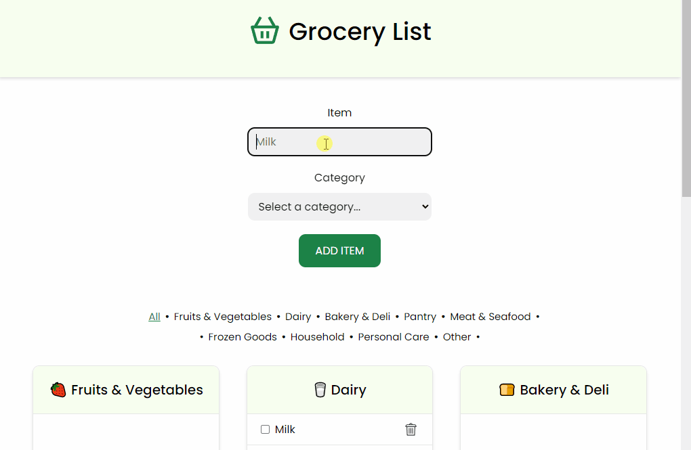
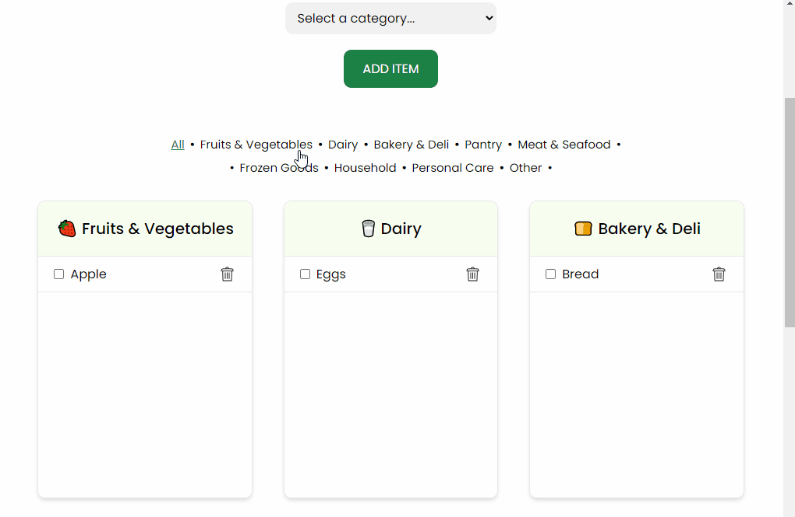

# Grocery List 🛒

Grocery list application built with HTML, CSS/SASS, and JavaScript, and stored using local storage. The list is divided into nine categories: Fruits & Vegetables, Dairy, Bakery & Deli, Pantry, Meat & Seafood, Frozen Goods, Household, Personal Care, and Other. The user can add an item to the list by filling in the input field and selecting one of the categories.

## 🛠️ Technologies

- HTML
- CSS/SASS
- JavaScript

## 🔗 Link

- [Grocery List](https://julianachagas.github.io/grocery-list/)

## 💡 Features

- [x] Add a new item to the list
  - [x] An error message is displayed if the item is already on the list or no category was selected
  - [x] A success message is displayed if the item was successfully added
- [x] Delete a item from the list
- [x] Mark a item as checked
- [x] The list is stored locally (local storage): item's name, category, and status (checked or unchecked).
- [x] The stored list is displayed when the page loads
- [x] Navigation menu: show all categories or each category individually

## 💻 Demo

- Add/mark/remove item

  

- Categories Menu

  

## 👩🏻‍💻 Author

---

##### Made with 💜 by Juliana Chagas
